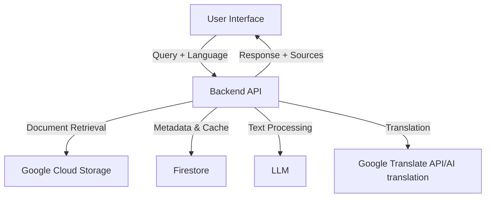

# Policy Document Analyzer

A multilingual document analysis system that enables natural language queries across policy documents and related discussions. The system provides relevant document sections and generates context-aware responses in multiple languages.

## 🎯 Motivation

Organizations often deal with complex policy documents and related discussions spread across multiple files. This project aims to:
- Make policy information easily accessible through natural language queries
- Provide accurate, context-aware responses with source citations
- Break down language barriers by supporting multilingual queries and responses
- Surface relevant sections from source documents for transparency

## 🏗️ Architecture

### System Overview

### Components
1. **Frontend (React)**
   - Multilingual user interface
   - Language selection
   - Query input
   - Results display with source citations

2. **Backend (Google Cloud Functions)**
   - Document processing and text extraction
   - Query processing and translation
   - Context-aware response generation
   - Source document retrieval

3. **Storage**
   - Google Cloud Storage for document storage
   - Firestore for metadata and cached responses

## 🚀 Features

- **Multilingual Support**
  - Query in any language
  - Language-specific responses

- **Document Processing**
  - PDF text extraction
  - Intelligent text chunking
  - Metadata preservation

- **Smart Querying**
  - Context-aware responses
  - Source document citations
  - Relevant section highlighting
